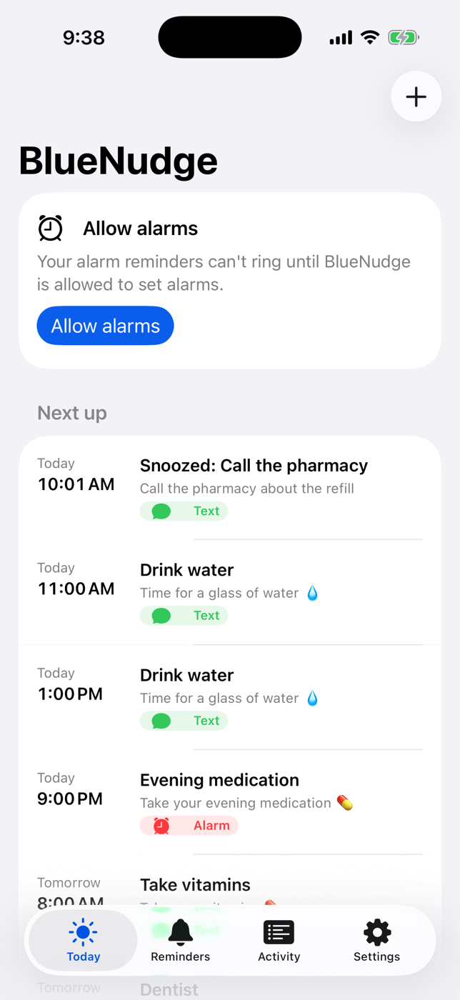
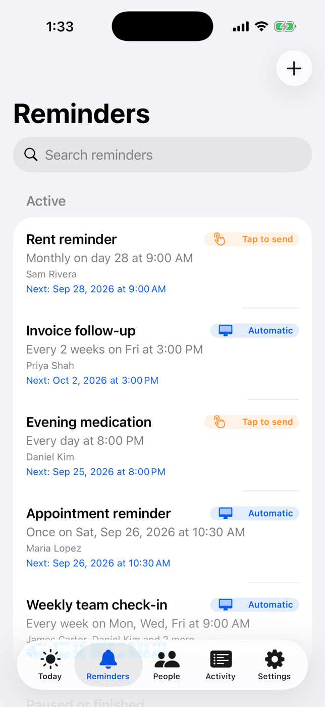
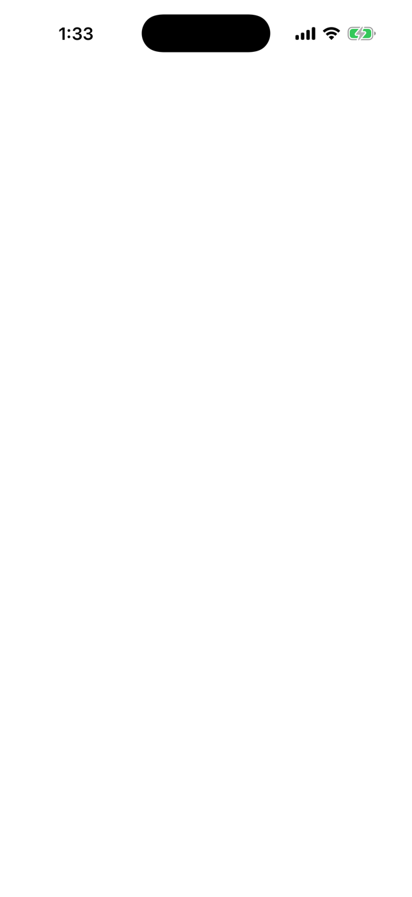
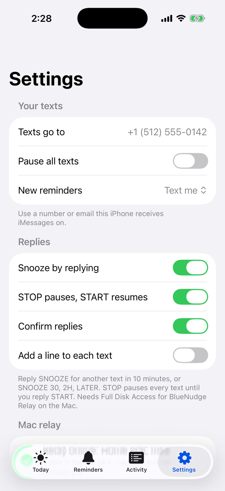

# BlueNudge

Reminders that arrive as texts. You set a reminder on your iPhone and it lands
in Messages as a real text at the right time: hard to miss, easy to find
later, and you can reply **SNOOZE** or **STOP**. There is no per-text cost:
the texts go out through the Messages app on a Mac you own, so there's no SMS
gateway, no server and no monthly fee.

| Part | What it does |
| --- | --- |
| **BlueNudge** (iPhone/iPad) | Create reminders, see what's next and what was sent, set the number texts go to. Works on its own with notifications. |
| **BlueNudge Relay** (Mac menu bar) | Texts you each reminder through Messages when it's due, confirms delivery and reads your replies (SNOOZE, STOP, START). |
| **ReminderCore** (Swift package) | Scheduling, message templates, phone-number handling and reply parsing shared by both apps. Tested on Linux and macOS. |

## Screenshots

The images in [`docs/screenshots`](docs/screenshots) come from the apps
running with sample data (see [Screenshots](#screenshots-1) below).

| Today | Reminders | Editor | Settings |
| --- | --- | --- | --- |
|  |  |  |  |

## Why a Mac?

Apple doesn't let iPhone apps send texts by themselves: the compose sheet
always needs a tap. The only way to send iMessages unattended without a paid
gateway is a Mac signed in to Messages, driven through Messages' AppleScript
interface. So each reminder is either:

- **Text me:** sent by BlueNudge Relay on your Mac. Needs any Mac on macOS 14+ that stays on.
- **Notification only:** a regular notification on the iPhone, with a Snooze action. No Mac needed.

```
iPhone app ──(your private iCloud / CloudKit)── Mac relay ──AppleScript──▶ Messages ──iMessage──▶ your iPhone
                                                     │
                                                     └── reads chat.db (Full Disk Access) for delivery and your replies
```

### Why the Mac needs a second Apple Account

A text sent from your own Apple Account to yourself shows up as one *you*
sent, so your iPhone doesn't alert you. The Mac's Messages app therefore signs
in to a second Apple Account (free to create) and texts you from there; the
texts then arrive like any other incoming message. The Mac's iCloud stays on
your own account so the relay can see your reminders.

## Features

- Once, hourly, daily, weekly (chosen weekdays), monthly, yearly, every N units, with an end date or a count.
- Quiet hours for hourly reminders, e.g. "every 2 hours, 9 AM–9 PM".
- Quick times for one-off reminders: in 10 minutes, in an hour, this evening, tomorrow morning, next Monday.
- Reply to a text: **SNOOZE** (10 min), **SNOOZE 30**, **2H**, **LATER**, "remind me in an hour" sends it again; **STOP** pauses every text until **START**; **DONE** is noted. Only replies from your own number count, and each is confirmed with a short text (can be turned off).
- Siri and Shortcuts: "Text me a reminder with BlueNudge" adds a one-time reminder without opening the app.
- Today screen: what's next, what was texted, and anything late because the Mac was off or asleep.
- Activity log from every device (sent, delivered, failed, missed, paused), search and CSV export.
- Wall-clock times survive daylight-saving changes; each reminder keeps its own time zone.
- `{time}`, `{date}`, `{weekday}` and `{title}` placeholders in the text.
- Relay: grace window for late texts, missed-text logging, delivery confirmation, per-hour cap, heartbeat and automatic single-relay election if you run it on two Macs, keep-awake and open-at-login.
- iCloud sync status on both devices: last sync, or why it failed.

## What it costs

| Item | Cost |
| --- | --- |
| Per text | $0 (iMessage between your two Apple Accounts) |
| Servers / sync | $0 (your private iCloud database) |
| Apple Developer Program | $99/year, needed for iCloud sync between iPhone and Mac, TestFlight and the App Store, and to keep the app installed longer than 7 days |
| Mac | One you already own, that can stay on |

## Requirements

- Xcode 26 or later on a Mac.
- iPhone or iPad on iOS 17 or later.
- For texts: a Mac on macOS 14 or later, a second Apple Account for its Messages app, and iCloud on the Mac signed in to the same Apple Account as the iPhone.

## Setup

### 1. Open and sign

1. Open `BlueNudge.xcodeproj`.
2. For both targets (**BlueNudge** and **BlueNudgeRelay**), open *Signing & Capabilities* and pick your Team.
3. Both targets use the iCloud container `iCloud.com.amgaviationgroup.bluenudge`. If Xcode reports it missing, tick it in the iCloud section so Xcode creates it. The same container must be ticked in both targets.
4. To use your own bundle IDs, see [Changing identifiers](#changing-identifiers).

Without a paid developer account, remove the iCloud and Push Notifications
capabilities from the iPhone target: the app then runs on-device only with
notification reminders (the relay can't see its data).

### 2. iPhone app

Run the **BlueNudge** scheme on your iPhone. The first launch asks whether
there's a Mac to send texts and, if so, the number or iMessage email to text.

### 3. Mac relay

1. Create a second Apple Account at [account.apple.com](https://account.apple.com) if you don't have one.
2. On the Mac, open *Messages › Settings › iMessage* and sign in with that second account. Leave *System Settings › Apple Account / iCloud* on your own account.
3. Run the **BlueNudgeRelay** scheme. It lives in the menu bar; the dashboard opens on first launch.
4. Click **Grant access** and allow it to control Messages.
5. Add *BlueNudge Relay* to *System Settings › Privacy & Security › Full Disk Access* and click **Recheck**. This turns on replies (SNOOZE, STOP, START) and delivery confirmation.
6. Turn on **Open at login** and **Keep this Mac awake**. A closed laptop lid still sleeps the Mac.
7. On the iPhone, save the second account's email as a contact (e.g. "BlueNudge"). With *Screen Unknown Senders* on, texts from unknown senders arrive without an alert.
8. Use **Test** in the relay dashboard to send one text and check your iPhone alerts you.

### Shipping through TestFlight or the App Store

- Before the first TestFlight build, deploy the CloudKit schema to Production in the [CloudKit Console](https://icloud.developer.apple.com). Development builds (run from Xcode) and TestFlight/App Store builds use separate CloudKit environments, so an Xcode-built relay only sees an Xcode-built iPhone app. Build both the same way.
- The iPhone app uses only public APIs. The Mac relay cannot go on the Mac App Store (it is not sandboxed, scripts Messages and reads its database); run it from Xcode or distribute it signed with Developer ID and notarized.
- Don't use "iMessage" in the app's name; Apple's trademark rules allow it only in phrases like "works with iMessage".

## Project layout

```
App/Shared/        SwiftData models, iCloud store, repository, reply handling (both apps)
App/iOS/           iPhone app: views, notifications, Siri/Shortcuts intent
App/macOS/         Mac relay: engine, Messages sender, chat.db reader, menu bar + dashboard
Packages/ReminderCore/  Platform-neutral logic + unit tests
Tests/BlueNudgeTests/   Data-layer, reply and relay tests (macOS)
project.yml        XcodeGen spec (BlueNudge.xcodeproj is generated from it)
scripts/           App icons and screenshot capture
```

## Development

```sh
# Core logic tests (macOS or Linux)
swift test --package-path Packages/ReminderCore

# App tests on a Mac: SwiftData queries, reply handling, Messages database
# queries and the relay's AppleScript (compiled against Messages, nothing is sent)
xcodebuild test -project BlueNudge.xcodeproj -scheme BlueNudgeTests -destination 'platform=macOS'

# After editing project.yml
brew install xcodegen && xcodegen generate
```

CI (`.github/workflows/ci.yml`) runs the core tests on Linux, then on macOS,
builds both apps with signing disabled and runs the app tests.

### Screenshots

Debug builds have a demo mode with sample data that never touches real data:
launch the iPhone app with `-BlueNudgeDemo YES -BlueNudgeScreen today`
(or `reminders`, `editor`, `activity`, `settings`, `onboarding`). The
*Screenshots* workflow captures every screen in the iOS Simulator plus the Mac
relay's windows and commits them to `docs/screenshots`; run it from the Actions
tab or add the `screenshots` label to a pull request.

### Changing identifiers

Edit `project.yml`: `bundleIdPrefix`, both `PRODUCT_BUNDLE_IDENTIFIER` values
and the iCloud container in both `entitlements` blocks (keep it identical in
both), then run `xcodegen generate`. The code reads the container from the
entitlements, so nothing else changes.

## Data model rules (CloudKit)

Models live in `App/Shared/Models.swift` and follow CloudKit's constraints:
every property has a default, there are no unique constraints and no
relationships (links are stored as UUIDs). Once the schema is deployed to
Production, properties can be added but never renamed or removed.

## Limits

- Texts only go out while the Mac is on, awake and online. Late texts are sent
  within the grace window you set (default 60 minutes); later ones are logged
  as missed.
- iCloud's terms cover personal use. This design is for texting yourself from
  your own Mac; a service that texts other people from one central account is
  a different product with different rules.
- Apple can restrict Apple Accounts that send large volumes of automated
  messages. The relay caps texts per hour; keep hourly reminders to waking
  hours.
